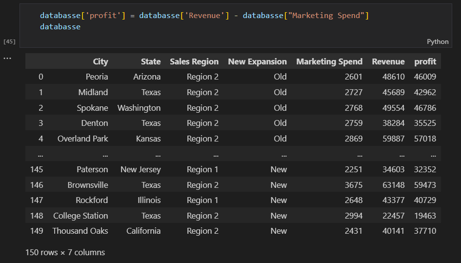
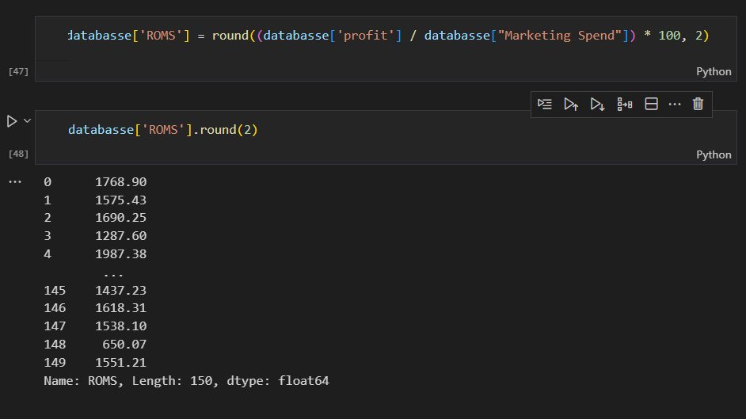
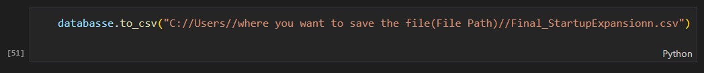
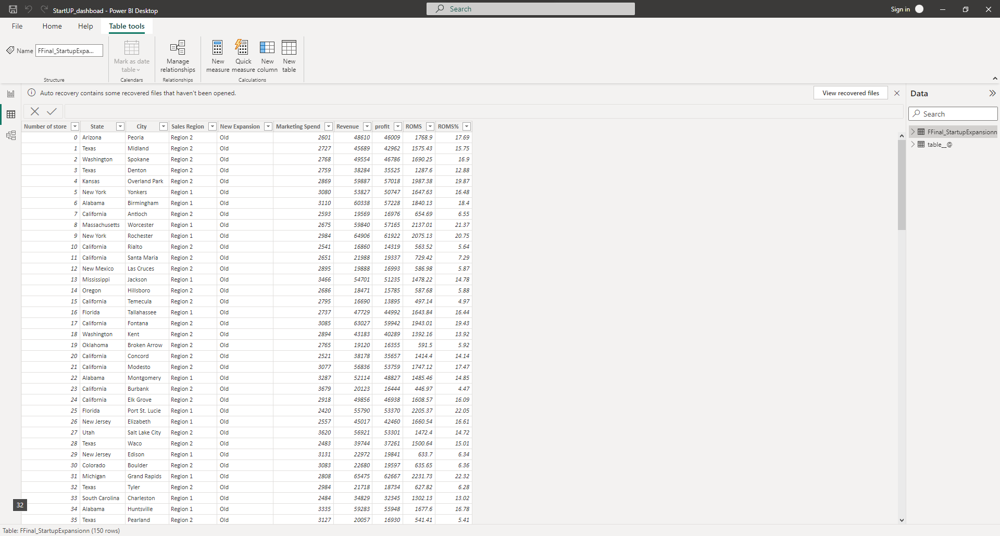

# 1-StartupExpansion
--------------------

--------------------
## Introduction

This is my first project as a data analysis (Self-Taught), The aim of this project is to show what I learned by implementing my analyzing and visualizing skills that i learned using (Python and Power BI).

## Problem Statement

The owner has 150 stores across the united states of America and he thinking of expanding more, but before expanding more he wants to know more about his stores through a dashboard.

### The owner requirements :

- I want to know the Profit of all stores by State, City, Sales Region, Expansion,
- and the same for Revenue, Marketing Spend, and the (ROMS) 'return on marketing spend',
- and add the location for every single one, and maybe a top 5,
- and put these requirements into a dashboard.

### TOOLS
- PYTHON
-	POWER BI
-	MICROSOFT EXCEL

## Data Sourcing

The data was in the [Kaggle](https://www.kaggle.com/datasets/mohamedkouchaoui/startupexpansion) website.
The dataset contains 150 rows and 7 columns.

### About the data : 
- Store ID : store a unique identity 
- State : the name of the state
- City : the name of the city
- Sales Region : the region of the store
- New Expansion : the Expansion was new or old
- Marketing Spend : how much was spent on marketing
- Revenue : the revenue from the Store

## Cleaning & Analysis

### The data was cleaned so we don't need to clean anything.
### Here, we could discover the following things in the dataset:
    1.	There are 150 STORES, and the MEAN of all 'Marketing Spend' = 2893.15, the MIN = 1811.00, and the MAX = 3984.00 ,,,,, and all the MEAN 'Revenue' = 39301.43, and the MIN = 15562.00, and the MAX = 68828.00
    2.	The most stores in 1 state is in California = 40 stores, Texas = 17, Florida = 12, Washington = 7
    3.	The most stores in 1 city is in Rochester = 2 stores, and the rest is 1
    4.	The MEAN in Region_1 is more (40567.20) than Region_2 (38359.47) and the MIN in Region_1 is more (17006.0) than Region_2 (15562.0) but the MAX in Region_1 is less (65475.0) than the Region_2 (68828.0)
    5.	The MEAN in Region_1 is less (2889.00) than the Region_2 (2896.23) and the MIN in Region_1 is more (2028.0) than the Region_2 (1811.0) but the MAX in Region_1 is less (3586.0) than the Region_2 (3984.0)
    6.	The Revenue in Region_1(2596301) is less than Region_2(3298914), so the most Revenue is coming from Region_2
    7.	The Marketing Spend in Region_1(184896) is less than Region_2(249076), so the less Marketing Spend is Region_1
    8.	California is the most suitable city for most successful startups with low spending, followed by Washington

### Adding the Profit and ROMS

profit Formula is (Profit = Revenue - Marketing Spend)

---------------
ROMS Formula is (ROMS = (profit / Marketing Spend)* 100)

---------------

## Data Transformation

###After finishing the analysis in Python I print the new data frame into a CSV file and transform it into power bi.

------------
### No cleaning has been required and no values were missing

## Modeling

No modeling was required since we need just a table for the analysis.

-----------
##The dashboard
